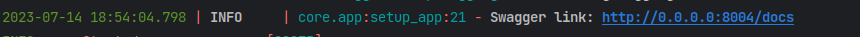

# My blog: Authentication service

___
<span id="0"></span>
### [Консольные команды](docs/comand.md)

### <span id="1">1. </span><span style="color:purple">Описание</span>

Пример сервиса авторизации. 

__Подробная информация по Api:__

- Swagger документация http://127.0.0.1:8000/docs
- Swagger(альтернатива) http://127.0.0.1:8000/redoc

Точная ссылка к документации выводится в логах при запуске сервиса.

___

### <span id="2">2. </span><span style="color:purple">Запуск сервиса</span>

* </span><span style="color:orange">__Клонируем репозиторий:__</span>

```bash
git clone git@github.com:VIVERA83/derbit.git
```

* </span><span style="color:orange">__Переходи в папку с проектом:__</span>

```bash
cd derbit
```

* </span><span style="color:orange">__Создаем файл .env (с переменными окружения) на основе
  примера [.env_example](.env_example)*:__</span>


В ОС windows можно скопировать фаил [.env_example](.env_example) в `.env` командой `copy`

```shell
copy /Y ".env_example" ".env"
```

* </span><span style="color:orange">__Запускаем приложение в контейнере:__</span>

```bash
docker-compose up --build
```

* </span><span style="color:orange">__Открываем Swagger:__</span>

Переходим по ссылке указанной в консоли на страницу с документацией


Если запуск произведен локально то http://127.0.0.1:8000/docs
___

### [Наверх](#0)